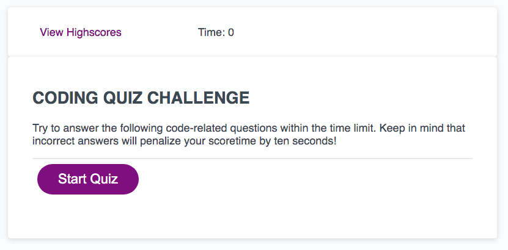
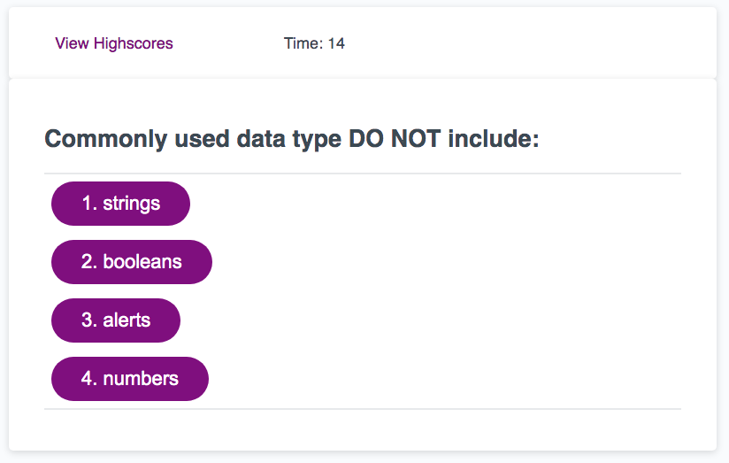
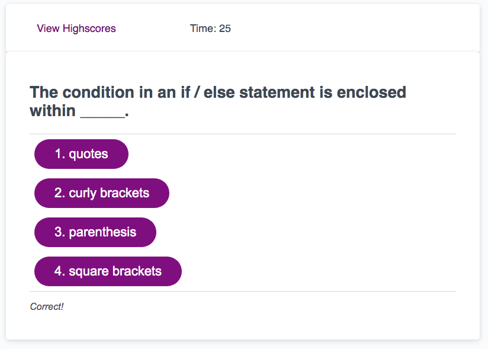
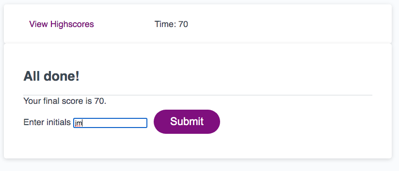
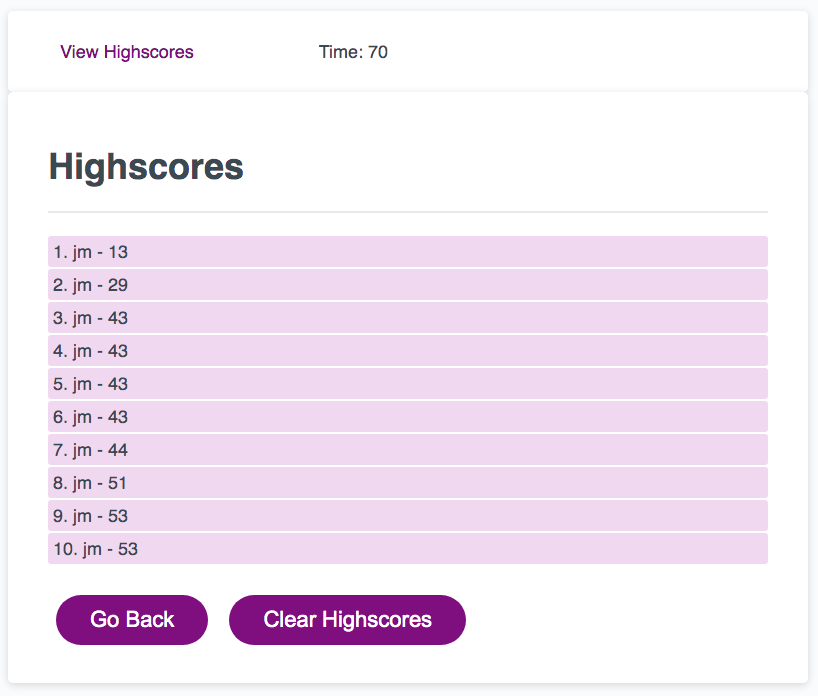

# Code_Quiz
CODE QUIZ

Week 4 homework was to build a timed coding quiz with multiple-choice questions. This app runs in the browser and features dynamically updated HTML and CSS powered by JavaScript code. It has a clean, polished, and responsive user interface. 

The code includes storing the results in the User's browers local storage and displaying the top ten results only. 

